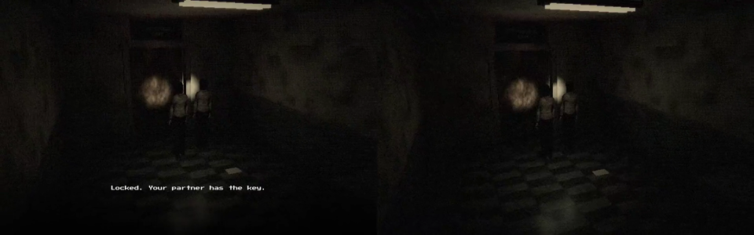
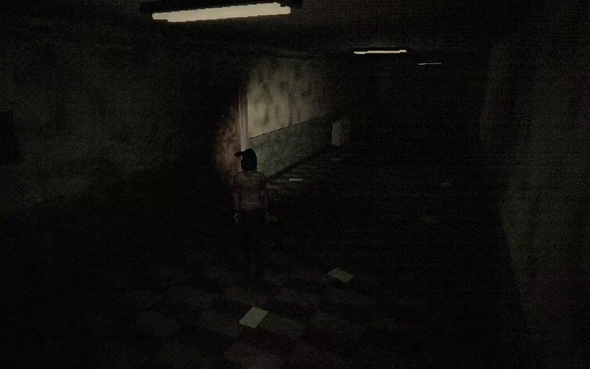
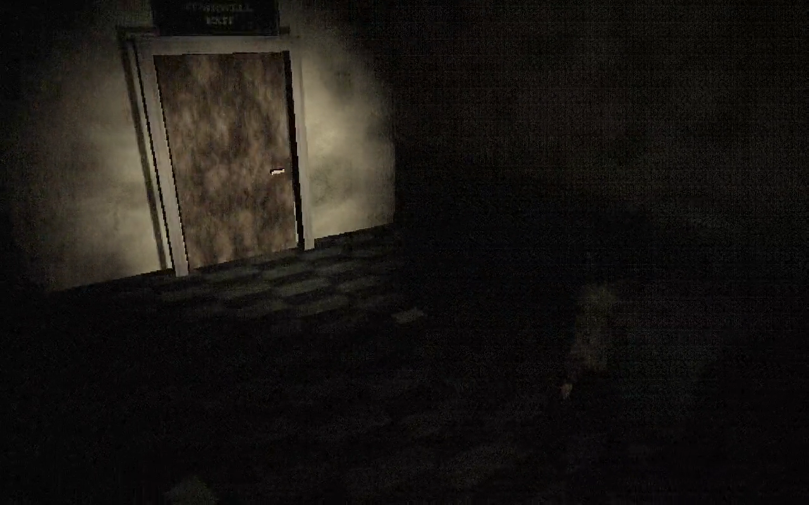
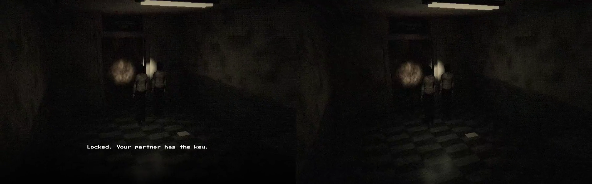
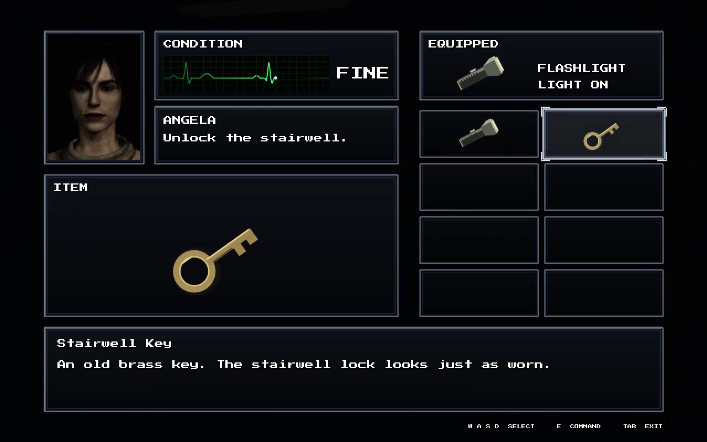
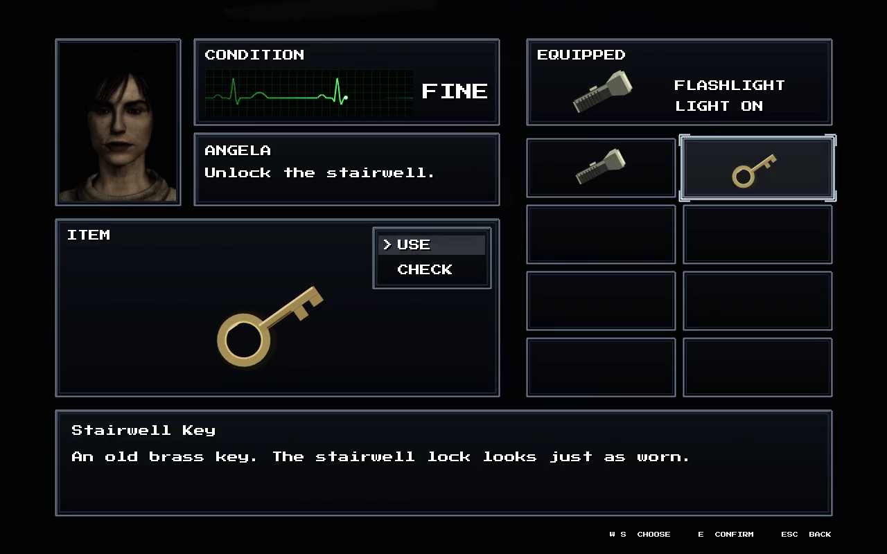

# MARRY — Game Engine (C++)

A 3D game engine written from scratch in **C++17 and OpenGL 3.3**, and a fixed-camera horror prototype built on it with **online co-op**.

> This repository is a showcase. The source code is private; what's here is footage, screenshots and a description of what the engine does.

*Online co-op: two networked copies of the game, each player with their own fixed camera. ▶ [Watch](videos/project-s-online-coop.mp4)*

---

## The engine

| | |
|---|---|
| **Rendering** | Physically based materials with normal and roughness maps, up to 8 point lights and 4 spotlights, shadow-mapped flashlights, screen-space ambient occlusion, bloom, ACES tone mapping, exponential fog |
| **The look** | A post-processing pass built for horror: film grain, chromatic aberration, vignette, colour grading, and an optional fixed low-resolution (480p) render with ordered dithering for a PS1/PS2-era image |
| **Physics** | Rigid bodies with stacking, friction and sleeping; ragdolls built from cone-twist and hinge joints; swept collision for fast movers; character movement that slides along walls. A pile of 1,000 mixed bodies simulates in about 2.4 ms per frame |
| **Animation** | Skeletal animation with a weighted 22-bone rig, eight authored clips, cross-fade blending, and playback that follows the character's actual speed so feet don't skate |
| **Networking** | Two-player online co-op over UDP: each machine moves its own player, the host owns the shared world (keys, doors, the ending), and events arrive reliably and in order |
| **Audio** | Positional one-shots, streamed looping music and a 3D listener |
| **UI** | Pixel-font text, menus and full-screen inventory screens drawn after post-processing, so the grain never eats the text |
| **Tooling** | Built-in self-tests for every game, deterministic recording straight to video, scripted demo runs, model and animation import |

Developed on macOS; the engine also builds on Windows and Linux.

---

## Project S

A fixed-camera psychological horror prototype set in a decayed corridor: camera angles that turn to follow you, tank controls, failing fluorescent tubes, a flashlight that does most of the work, and a heavy noise filter. Locked rooms, a brass key, a stairwell out.

*A full run, with sound. ▶ [Watch](videos/project-s-tour.mp4)*

**Online co-op.** A second player joins over the network. Each player has their own camera based on where they are standing, as in Resident Evil Outbreak. Examine text is personal; the key is not — only whoever picked it up can open the stairwell, and their partner is told so.

**Inventory.** A classic Resident Evil status screen: character portrait, a sweeping ECG condition monitor, the equipped item, a 2 × 4 item grid, USE / CHECK commands, and a CHECK view that turns the item over.

---

*Project S* is a non-commercial tech demo. Some character and audio assets in it belong to their respective owners and are used for demonstration only; Resident Evil belongs to Capcom. None of these owners is affiliated with this project. The MARRY engine is original work. All rights reserved; see [LICENSE](LICENSE).
